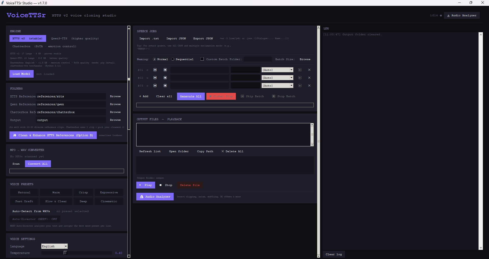

# VoiceTTSr (Voice Text-To-Speech Renderer) 🎙️




**VoiceTTSr (Voice Text-To-Speech Renderer)** is a high-performance, multi-engine voice cloning studio that provides a unified interface for **XTTS v2**, **Qwen3-TTS**, **Chatterbox TTS**, and **RVC v2**.

By leveraging a standalone subprocess worker architecture, VoiceTTSr eliminates "dependency hell" by running each ML engine in its own isolated Python environment while maintaining a responsive, real-time GUI.

---

## 🚀 1-Minute Quick Start

If you are a new user and want the fastest way to get started:

1.  **Open PowerShell** in the folder where you want to install.
2.  **Copy & Paste** this command:
    ```powershell
    curl -L https://github.com/mosesrb/VoiceTTSr/raw/main/install_VoiceTTSr.bat -o install.bat; .\install.bat
    ```
3.  **Launch** using `VoiceTTSr.bat`.

*Alternatively, you can manually download [install_VoiceTTSr.bat](https://github.com/mosesrb/VoiceTTSr/raw/main/install_VoiceTTSr.bat) and run it.*

---

## 🏷️ Versioning & Changelog

VoiceTTSr uses standard [Semantic Versioning](https://semver.org/). 

**Current Stable Release: v1.7.0**
- Integrated **Chatterbox TTS** engine for state-of-the-art flow-matching synthesis and emotion control
- Fortified backend initialization against PyTorch 2.6 security updates (`weights_only` lockout)
- Scrubbed `CONDA_PREFIX` environment leaks when isolating cross-engine workers
- Refactored `_jobs_frame` layout to eradicate scrolling gaps

---

## 🎨 Key Features

*   **Chatterbox Engine (NEW)**: State-of-the-art flow-matching synthesis. Offers nuanced emotion, exaggeration control, and rapid iteration.
*   **XTTS v1/v2 Engine**: Stable, high-fidelity voice cloning across 17+ languages.
*   **Qwen3-TTS Engine**: Expressive synthesis with "Power Mode" for emotional acting.
*   **RVC v2 Integration**: Post-processing "reskinning" for maximum character accuracy and pitch control.
*   **Batch Processing**: Rapidly process groups of audio files with granular skip/stop controls.
*   **Skyrim SE Integration**: Dedicated utility for generating `.lip` and `.xwm` files for Bethesda modding.
*   **Audio Analyzer**: Integrated tools to check reference audio health and loudness.

---

## 📖 How to Use

VoiceTTSr Studio is designed for a streamlined "Top-to-Bottom" workflow:

1.  **Select Engine**: Toggle between **XTTS v2** (Stable/Natural), **Qwen3-TTS** (Expressive), or **Chatterbox** (SoTA/Emotion Control) in the engine panel.
2.  **Initialize**: Click **Load Model** to wake up the isolated worker process.
3.  **Reference Audio**:
    *   Place your target voice clean WAV files in the respective `references/xtts`, `references/qwen`, or `references/chatterbox` folders.
    *   Use the **🔬 Audio Analyzer** to verify your clips have low noise and consistent volume.
4.  **Draft Dialogue**: Add rows in the **Speech Jobs** list, enter your text, and assign a Mood/Preset (e.g., "Warm", "Expressive").
5.  **Render**: Click **🚀 Generate All** to process the entire queue. Use **Global Stop** for an immediate mid-render halt.

---

## 👤 Voice Profiles

Stop re-loading reference files every time. Use **Voice Profiles** to save your finalized voice settings:

### XTTS Profiles (`.pth`)
*   **What they are**: Pre-calculated "latents" of a voice. 
*   **Benefit**: Loading a `.pth` is 10x faster than scanning 30 WAV files and reduces VRAM overhead.
*   **Workflow**: Load your WAVs once → Click **Save Profile** → Give it a name. Use **Load Profile** next time to pick it instantly.

### Qwen Profiles (`.qproc`)
*   **What they are**: Scored reference packages for the Qwen ICL (In-Context Learning) engine.
*   **Benefit**: Remembers specifically which of your reference clips were "Higher Quality" for the Qwen engine's emotional acting mode.

### Chatterbox Profiles (`.cbprof`)
*   **What they are**: Stored PyTorch flow-matching condition vectors from a specific speaker's reference audio.
*   **Benefit**: Eliminates the delay of processing reference audio and extracting speaker conditions during generation. Emotion/exaggeration applies cleanly on top of the saved profile.
*   **Workflow**: Place a single clean reference clip in the references folder → Select it → Click **Save Profile**. Use **Load Profile** next time to instantly re-apply that exact voice conditioning.

---

---

## 🛠️ Installation & Setup

VoiceTTSr is designed to be "plug-and-play." To set up your local studio and all three AI engines:

1.  Ensure **Python 3.10** and **Git** are installed on your system.
2.  Run the master installer:
    ```cmd
    install_all.bat
    ```
    *This will automatically create 3 isolated virtual environments, install all ML dependencies (~8GB total), and download the required Hubert/RMVPE baseline models.*

---

## 🚀 Launching the App

Once the installation is complete, launch the studio via:
```cmd
VoiceTTSr.bat
```
*(Or use the created Desktop Shortcut)*

---

## 🏗️ Architecture

VoiceTTSr uses a **Subprocess Worker Architecture** to handle large machine learning models:
*   **GUI**: Minimalist Python environment (pygame/pydub/numpy).
*   **XTTS Worker**: Isolated venv (TTS/transformers/torch).
*   **Qwen Worker**: Isolated venv (qwen-tts/transformers/accelerate).
*   **RVC Worker**: Isolated venv (rvc-python/fairseq/rmvpe).

This design ensures that version conflicts between different engines are impossible and the GUI remains perfectly fluid during long generation tasks.

---

**VoiceTTSr (Voice Text-To-Speech Renderer)** — Rounding up the edge of Voice Synthesis.

---

## ?? License & Attribution


**VoiceTTSr** is an open-source project created by **mosesrb (Moses Bharshankar)**.

This project is licensed under the **GNU General Public License v3.0**. You are free to view, modify, and redistribute this software as long as you adhere to the terms of the GPL-v3 (i.e., any derivative works must also be open-source and credit the original author).

Copyright (c) 2026 Moses Bharshankar
