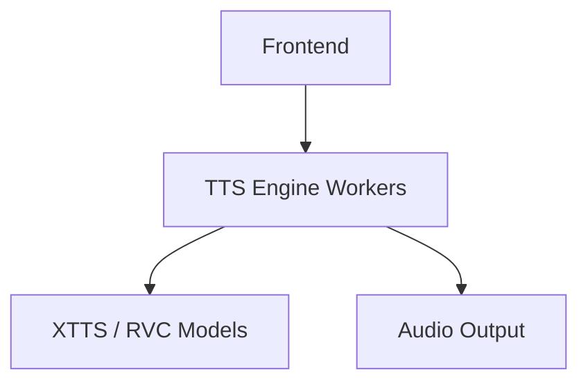

# 🎙️ VoiceTTSr


🚀 A local, GUI-based voice generation system supporting XTTS, RVC, and style-controlled speech synthesis. Turn text into expressive speech using your own voice models — fully offline.

## 🎬 Demo


## ⚡ Quick Start

```bash
git clone https://github.com/mosesrb/VoiceTTSr.git
cd VoiceTTSr
install_all.bat
start.bat
```
Open browser at: `http://localhost:xxxx`

## 🧠 How It Works

1. Load voice profile.
2. Input text + style.
3. Engine processes into waveform.
4. Output audio.

## ✨ Key Features

- **Local Processing**: Fully offline privacy.
- **Multi-Model Support**: Integrated XTTS and RVC.
- **Style Control**: Precise emotional synthesis.

## 🏗 Architecture



## 📜 License
This project licensed under GPL-v3.
