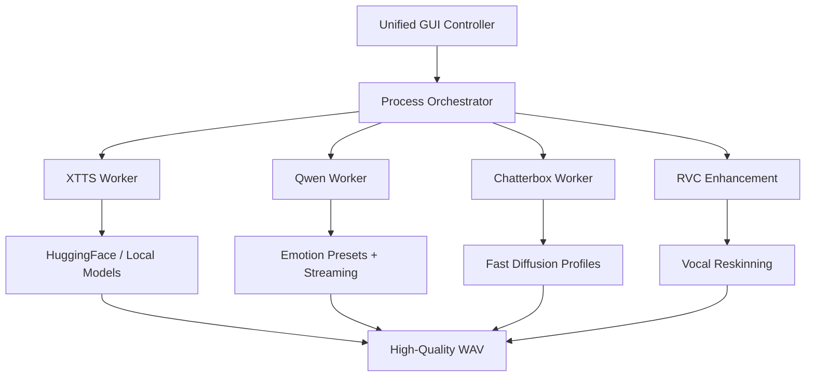

# 🎙️ VoiceTTSr


🚀 A universal, local voice generation orchestrator. Synthesize high-fidelity speech using XTTS, expressive acting with Qwen, and lightning-fast diffusion with Chatterbox — all through a unified GUI.

## 🎬 Demo


## ⚡ Quick Start

```bash
git clone https://github.com/mosesrb/VoiceTTSr.git
cd VoiceTTSr
install_all.bat
VoiceTTSr.bat
```

## ✨ Core Engines

### 🤖 XTTS v2
The gold standard for high-fidelity voice cloning.
- **Deep Cloning**: Stable, faithful reproduction from 6 seconds of audio.
- **Multi-lingual**: Support for English, Hindi, CJK, and more.
- **Stable Narration**: Optimized for long-form podcasts and audiobooks.

### 🎭 Qwen3-TTS
The engine for expressive acting and emotional range.
- **Emotion Presets**: Native support for *Seductive*, *Aggressive*, *Warm*, and *Breathy* tones.
- **Dynamic Tagging**: Context-aware emotion markers for nuanced performances.
- **Streaming**: Real-time audio preview as the model generates.

### ⚡ Chatterbox
Proprietary flow-matching synthesis.
- **Ultra-Fast**: Diffusion steps capped at 40 (optimized from 1000) for instant response.
- **Memory Efficient**: High-quality output with a lower VRAM footprint.
- **Profiles**: Native `.cbprof` support for instant-load voice conditioning.

### 🔄 RVC Enhancement
Retrieval-based Voice Conversion integration.
- **Zero-Artifact**: Reskin synthesized audio to match a target character perfectly.
- **Character+**: Inject specific vocal textures that standard TTS cannot reach.

## 🧠 Smart Features

- **Profile Management**: Save and load averaged voice embeddings (.pt, .cbprof) for instant reuse.
- **Mumble Guard**: Integrated silence/artifact detection to auto-retry failed generations.
- **Skyrim Integration**: Specialized tools for `.fuz` generation and lip-sync mapping for modders.

## 🏗 Architecture

VoiceTTSr uses a modular worker system. Each engine runs in its own isolated environment, preventing dependency conflicts and ensuring maximum performance.



## 📜 License
This project is licensed under GPL-v3.
