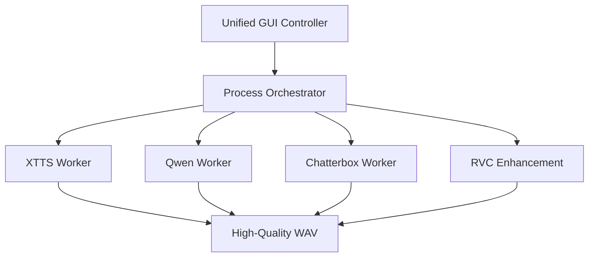

# 🎙️ VoiceTTSr


**VoiceTTSr** is a local-first voice synthesis orchestrator designed for creators, modders, and privacy advocates. Instead of relying on cloud-based API credits, it leverages your local GPU to provide professional-grade cloning and emotional acting.

Whether you're generating thousands of lines for a Skyrim mod or crafting a custom persona for a private assistant, VoiceTTSr provides a unified interface for the world's most powerful open-source audio models.

---

## 🎬 How it Looks


## ⚡ The Quick Start

```bash
git clone https://github.com/mosesrb/VoiceTTSr.git
cd VoiceTTSr
install_all.bat  # Sets up isolated environments
VoiceTTSr.bat    # Launches the GUI
```

---

## 🛠️ The Tech Behind the Voice

We didn't just wrap a few models; we built a stable orchestration layer for production use.

### 🤖 Multi-Engine Worker System
Dependency conflicts are the death of local AI. VoiceTTSr uses a **Modular Worker Architecture**:
- Each engine (XTTS, Qwen, Chatterbox, RVC) operates in its own isolated Conda environment.
- Communication happens over a structured JSON protocol via subprocess pipes.
- This ensures that updating one model never breaks the others.



### 🎭 Emotional Acting (Qwen3-TTS)
Unlike standard TTS that sounds "robotic," our Qwen integration supports native emotional tagging. You can force the model into *Seductive*, *Aggressive*, or *Warm* tones without complex prompt engineering.

### ⚡ Ultra-Fast Iteration (Chatterbox)
For high-speed tasks, we've integrated **Chatterbox** with a proprietary flow-matching config. It bypasses the standard 1000-step diffusion process, capping it at 40 steps for near-instant audio generation with minimal quality loss.

### 🎯 Pro-Level Finishing (RVC)
Synthesized audio is often "dry." We include an integrated **RVC (Retrieval-based Voice Conversion)** layer to "re-skin" the output WAV, injecting the specific vocal texture and artifacts of a target character that pure synthesis often misses.

---

## 🧠 Smart Features

- **Profile Memory**: Saves averaged voice embeddings (.pt, .cbprof) so you can recall a specific "voice" instantly without re-uploading references.
- **Mumble Guard**: An automated post-processing check that detects digital artifacts or unexpected silence, triggering an auto-retry of the generation.
- **Modder's Toolkit**: Built-in support for generating Skyrim-compatible `.fuz` files and matching lip-sync phonemes.

## 🛡️ Privacy & Ownership

- **100% Offline**: No telemetry. No "checking for updates" in the middle of a session.
- **Data Sovereignty**: Your reference audio stays on your disk. Your synthesized voice stays in your VRAM.
- **Open Source**: Licensed under GPL-v3.

---

## 🏗 Installation Note
Due to various CUDA dependencies, we recommend at least 8GB of VRAM for the best experience. Use `install_all.bat` to handle the heavy lifting of environment creation.

---

*Built with ❤️ for the Local AI Community.*
