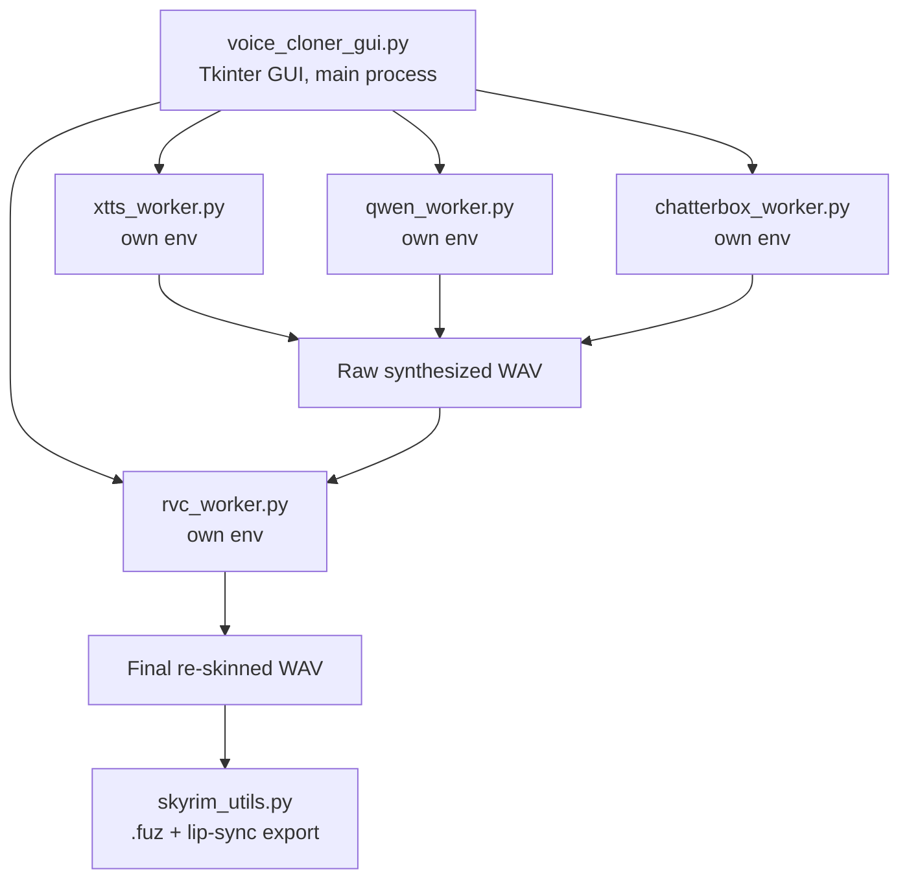

# VoiceTTSr — Architecture

**Last updated:** 2026-07-03 (documented as of commit `8b48c24`)

This document describes how VoiceTTSr is built, not how to use it (see `README.md`) or what's wrong with it (see `project_status.md` / `implementation_plan.md`).

---

## 1. High-level shape

VoiceTTSr is a **single Tkinter GUI process** that never loads any ML model itself. Instead, it spawns one **subprocess worker per engine**, each running in its own isolated Python environment (Conda env or venv), and talks to each worker over **stdin/stdout using line-delimited JSON**. This is the core architectural decision the whole project is built around, and it exists to solve one problem: XTTS, Qwen3-TTS, Chatterbox, and RVC each need incompatible versions of `torch`/`numpy`/`transformers`, so they cannot share one Python environment.



---

## 2. Module inventory

| File | Lines | Role |
|---|---|---|
| `voice_cloner_gui.py` | 3,853 | Main process. Tkinter UI, worker lifecycle management, profile management, Skyrim export UI, IPC client logic (`_TtsWorker` class family). |
| `rvc_worker.py` | 339 | RVC v2 voice-conversion worker: loads Hubert content encoder + RVC checkpoint, runs `infer` action. |
| `qwen_worker.py` | 314 | Qwen3-TTS worker: emotional-preset TTS generation, profile creation. |
| `xtts_worker.py` | 256 | Coqui XTTS v2 worker: zero-shot voice cloning from reference clips, ref-audio enhancement, post-processing. |
| `chatterbox_worker.py` | 253 | Chatterbox TTS worker: fast flow-matching TTS, profile save/load. |
| `skyrim_utils.py` | 139 | Non-ML helper: wraps `FaceFXWrapper.exe`/`xWMAEncode.exe` to produce Skyrim `.fuz` + lip files from a WAV. |
| `download_resources.py` | ~150 | First-run asset fetcher for required technical assets only (Hubert, RMVPE), with SHA-256 verification. No voice/persona models are downloaded by default as of the 2026-07-04 remediation -- see `docs/VOICE_ETHICS.md`. |

Supporting non-Python files: `install_all.bat` / `install_VoiceTTSr.bat` (env bootstrap), `setup_*_env.bat` (per-engine Conda/venv creation), `VoiceTTSr.bat` (launcher), `requirements.txt` / `rvc_requirements.txt` / `requirements_locked.txt` (dependency pins), `tools/` (bundled third-party binaries for Skyrim export), `references/` (sample reference audio), `Profiles/` and `Output/` (user-generated content directories, empty in the repo itself).

---

## 3. Process & environment model

- Each engine gets its own interpreter, referenced in `voice_cloner_gui.py` by a path constant (e.g. `_XTTS_PYTHON`, `_QWEN_ENV`, `_RVC_PYTHON`, `_CHATTERBOX_ENV`), pointing at a Conda-env or venv-specific `python.exe`.
- Workers are spawned with `subprocess.Popen([interpreter, worker_script, ...], stdin=PIPE, stdout=PIPE, stderr=STDOUT)` — always as an argument list, never through a shell.
- Before spawning, the GUI strips `PYTHONHOME` and `CONDA_*` environment variables from the child's env so the worker's own environment activation isn't clobbered by whatever env the GUI process happens to be running in.
- A dedicated reader thread per worker drains stdout and parses JSON lines, so the GUI's Tkinter mainloop is never blocked waiting on a worker.
- Workers are long-lived: once spawned, a worker stays resident (with its model loaded in memory/VRAM) and accepts multiple `generate`/`infer` requests until an explicit `quit` action, avoiding the cost of reloading model weights per request.

## 4. IPC protocol

All communication is **newline-delimited JSON** over stdin/stdout. Every worker implements at least `ping` (health check / readiness signal) and `quit` (graceful shutdown), plus engine-specific actions:

| Worker | Actions |
|---|---|
| `xtts_worker.py` | `ping`, `save_profile`, `generate`, `enhance_refs`, `post_process`, `quit` |
| `qwen_worker.py` | `ping`, `create_profile`, `generate`, `quit` |
| `chatterbox_worker.py` | `save_profile`, `load_profile`, `generate`, `quit` |
| `rvc_worker.py` | `infer`, `quit` |

Example request (XTTS generate, from the header comment in `xtts_worker.py`):

```json
{"action":"generate", "text":"...", "refs":["ref1.wav"], "lang":"en", "out":"output.wav", "speed":1.0}
```

The GUI's readiness/response wait has a **180-second timeout**, chosen to accommodate cold model loads on first request without hanging forever if a worker crashes silently.

### Typical generation pipeline (GUI-orchestrated, not worker-orchestrated)
1. GUI sends `generate` to the selected TTS worker (XTTS, Qwen, or Chatterbox) → raw synthesized WAV.
2. If RVC re-skinning is enabled, GUI sends `infer` to `rvc_worker.py` with the raw WAV as input → final re-skinned WAV (`..._rvc.wav`).
3. "Mumble Guard" post-processing runs on the final WAV; on detected artifact/silence, the GUI automatically re-triggers step 1.
4. If Skyrim export is requested, the GUI calls into `skyrim_utils.py` directly (in-process, not a worker) to shell out to the bundled `FaceFXWrapper.exe`/`xWMAEncode.exe` and produce `.fuz` + lip-sync files.

## 5. Data & file layout

| Path | Contents | Committed to git? |
|---|---|---|
| `references/` | Sample reference audio for cloning | Yes (samples only) |
| `Profiles/` | User-saved voice profiles (`.pt`, `.cbprof`) | Directory present, empty by default |
| `Output/` | Generated audio output | Directory present, empty by default |
| `tools/` | Third-party binaries (`FaceFXWrapper.exe`, `xWMAEncode.exe`) for Skyrim export. `FonixData.cdf` is deliberately **not** bundled -- see `docs/THIRD_PARTY_NOTICES.md` -- users must source their own copy from a Creation Kit install | Yes (except `FonixData.cdf`) |
| `rvc_models/` (created at runtime) | Downloaded RVC technical assets (`hubert_base.pt`, `rmvpe.pt`), SHA-256 verified on download. No voice/persona models are downloaded here by default | No — fetched by `download_resources.py` on first run |
| `*-env/` (created at runtime) | Per-engine Conda/venv environments | No — created by `setup_*_env.bat` |

Filenames derived from user input (profile names, output filenames) are passed through a regex allowlist (`[^a-zA-Z0-9_\-\.]` stripped) before being joined into a path with `os.path.join`, which is the project's main defense against path traversal — see the audit report for the full security review.

## 6. External dependencies / first-run network calls

`download_resources.py` fetches, over `requests`, with SHA-256 verification against pinned hashes (added 2026-07-04; a corrupted or tampered download is deleted and rejected rather than silently used):

- `hubert_base.pt` — RVC's content encoder, from `lj1995/VoiceConversionWebUI` on Hugging Face (the RVC project's own canonical space).
- `rmvpe.pt` — RVC's pitch extraction model, same source.

No voice/persona model is downloaded by default. An earlier version of this script also auto-downloaded two "baseline" RVC voice-conversion models from a different third-party mirror; this was removed after one was traced to an undisclosed real-person source (see `docs/VOICE_ETHICS.md` and `implementation_plan.md` Phase 0). An `OPTIONAL_VOICES` dict exists in `download_resources.py` for anyone who wants to opt into a specific, disclosed voice model themselves (`--include-optional` flag), empty by default.

`install_all.bat` additionally pulls the `TTS` package (Coqui XTTS v2) from PyPI, which carries its own model-weight license (CPML) distinct from this repo's GPL-3 code license — see `docs/THIRD_PARTY_NOTICES.md`.

## 7. Why this architecture (and its tradeoffs)

**Why subprocess isolation instead of one shared environment:** the four engines have genuinely conflicting dependency graphs (different `torch`/CUDA/`numpy`/`transformers` pins). A single shared venv would require picking one engine's dependency set and hoping the others tolerate it — brittle and prone to silent breakage on any engine update. Isolation trades some complexity (an IPC layer, longer cold-start) for the ability to update/replace any one engine without touching the others.

**Why long-lived workers instead of one-shot subprocess calls:** model load times (especially XTTS/RVC on GPU) are seconds-to-tens-of-seconds; a chat-like iterative workflow (try a line, adjust, retry) would be unusable if every generation paid that cost. The tradeoff is more state to manage (worker lifecycle, readiness, crash recovery) versus a simpler but slower one-shot-per-call model.

**Known architectural debt:** `voice_cloner_gui.py` at 3,853 lines mixes UI construction, worker lifecycle management, profile logic, and Skyrim export orchestration in one file. This doesn't affect runtime behavior but makes the codebase harder to navigate and test in isolation — tracked as Phase 3 in `implementation_plan.md`.

## 8. Related documents

- `project_status.md` — current release readiness and open issues.
- `implementation_plan.md` — phased plan to resolve audit findings, some of which touch this architecture (e.g., download integrity checks live in `download_resources.py`/`rvc_worker.py` described above).
- `VOICE_ETHICS.md` — policy behind what `download_resources.py` will and won't fetch by default.
- `THIRD_PARTY_NOTICES.md` — licensing details for every bundled/fetched third-party component mentioned above.
- `VoiceTTSr_Audit_Report.md` (repo root or wherever it was placed) — the original full audit this documentation set responds to.
